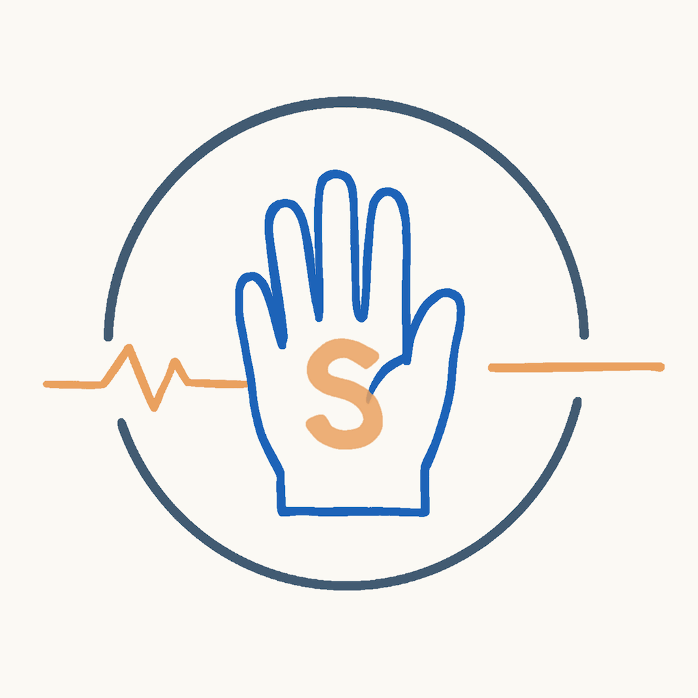
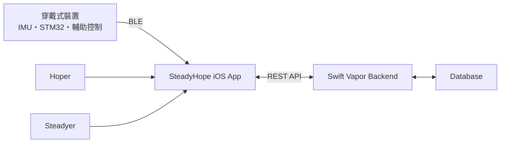

# SteadyHope iOS App

<p align="center">
  
</p>

<p align="center">
  帕金森氏症日常照護與手部震顫輔助系統
</p>

<p align="center">
  <sub>
    Logo 以震動波形經過穿戴式裝置後逐漸恢復平穩為概念</br>
    並融入代表 SteadyHope 的「S」意象。
  </sub>
</p>

SteadyHope 是以帕金森氏症日常照護情境為主題所開發的畢業專題研究原型，結合穿戴式裝置、iOS App、後端服務與訊號分析，協助使用者記錄手部動作、用藥、生理狀態與生活資訊，並整理成可供日常追蹤及回診溝通參考的資料。

本儲存庫主要保存 **SteadyHope iOS App** 的程式碼、功能實作與版本紀錄。

> **研究原型聲明**  
> SteadyHope 目前屬於畢業專題研究原型。震顫辨識、裝置配戴安全性、控制反應及輔助效果尚未完成完整臨床驗證。系統呈現的震顫特徵、生理資料、量表結果、用藥時間對照及 AI 摘要僅供日常健康紀錄與回診溝通參考，不可作為醫療診斷、疾病嚴重度判定或自行調整藥物的依據。

---

## 專題成果

- 淡江大學資訊管理學系 2026 專題製作競賽第三名
- 專題名稱：**SteadyHope－手望相助：智慧手部震顫輔助系統**（原題：以主動抑震為基礎之帕金森氏症智慧型輔助系統）
- 完成穿戴式裝置、iOS App、後端服務與震顫分析功能整合

### 個人負責項目

- 主要負責 SteadyHope iOS App 開發
- 負責 SwiftUI App、UI／UX 設計、REST API 串接與 BLE 資料整合
- 依 SteadyHope 演算法組規格實作 App 端 FFT／PSD、RMS、主要頻率可信度判斷及震顫資料呈現
- 負責 SteadyHope Logo 視覺設計

SteadyHope 完整畢業專題另包含穿戴式裝置、韌體、震顫分析演算法及後端服務。

完整團隊專案：

https://github.com/KevlnlOl7/SteadyHope

---

## 系統架構

SteadyHope 由穿戴式裝置、iOS App、後端服務與資料庫共同組成。App 負責穿戴式裝置資料接收、震顫分析、健康與照護紀錄，以及與後端服務進行資料交換。



穿戴式裝置韌體負責裝置端感測與輔助控制；App 則負責資料接收、分析、紀錄與呈現，兩者具有不同的處理目的。

---

## 使用者角色

SteadyHope 將系統使用者分為 Hoper 與 Steadyer 兩種角色。

### Hoper

主要配戴穿戴式裝置的使用者，可使用震顫紀錄、用藥管理、生理健康、自我評估、心情留言、AI 健康小助手與回診報告等主要功能。

### Steadyer

照護者角色，可與 Hoper 建立家庭連動，查看被照護者授權範圍內的健康資訊，並協助進行部分日常照護紀錄。

系統支援單一 Hoper 與多位 Steadyer 建立家庭連動關係。

---

## 主要功能

### 1. 穿戴式裝置與 BLE

App 使用 CoreBluetooth 與 SteadyHope 穿戴式裝置建立低功耗藍牙連線，負責接收感測資料與裝置狀態，並傳送相關控制指令。

主要功能包含：

- 搜尋及連線穿戴式裝置
- 顯示裝置連線狀態
- 顯示裝置剩餘電量
- 接收 IMU 即時取樣資料
- 接收馬達控制輸出狀態
- AUTO／MANUAL 模式切換
- 收線長度微調
- 裝置配戴初始化
- 基準線長校準
- 手機藍牙未開啟時提供操作引導

---

### 2. 即時震顫分析

App 接收穿戴式裝置傳回的 IMU 三軸角速度資料後，依照 SteadyHope 團隊演算法組所制定的 App 震顫分析規格，以滑動視窗進行 FFT／PSD、RMS 與主要頻率分析。

App 端依據演算法組提供的分析規格、判斷條件與參考測試資料，以 Swift 實作 FFT／PSD、RMS 與主要頻率可信度判斷，並整合 BLE 即時資料、圖表呈現、歷史紀錄與後端資料傳輸。

#### 震顫資料處理流程


相關演算法規格來源：

- [`algorithms/handoff/TREMOR_FREQUENCY.md`](https://github.com/KevlnlOl7/SteadyHope/blob/main/algorithms/handoff/TREMOR_FREQUENCY.md)
- [`algorithms/handoff/APP_PSD_IMPLEMENTATION.md`](https://github.com/KevlnlOl7/SteadyHope/blob/main/algorithms/handoff/APP_PSD_IMPLEMENTATION.md)

目前 App 端主要分析規格：

| 項目 | 規格 |
| --- | --- |
| 取樣頻率 | 100 Hz |
| 分析視窗 | 400 筆 |
| 視窗時間 | 約 4 秒 |
| 更新步長 | 50 筆 |
| 更新間隔 | 約 0.5 秒 |
| 頻率解析度 | 0.25 Hz |
| 強度趨勢 | 4–6 Hz RMS |
| 候選主要頻率 | 3–7 Hz |

目前 `frequencyReliable` 需同時符合：

```text
vector RMS >= 0.20 deg/s
3–7 Hz / 0.5–15 Hz power fraction >= 0.30
peak concentration >= 0.45
```

上述三項條件為演算法組制定的原型階段頻率顯示保護條件，用於避免 App 在靜置、雜訊或週期性特徵不明顯時顯示不可靠的主要頻率，並非疾病診斷門檻。

分析結果可呈現：

- RMS 震顫強度趨勢
- 主要頻率
- PSD 頻率特徵
- 馬達控制輸出狀態
- 分析時間
- 生活情境標記
- 使用者備註

> App 端的 `frequencyReliable` 用於表示目前分析所得主要頻率是否符合設定的可信度條件，不等同醫療診斷，也不代表單一分析紀錄即為一次臨床震顫發作。

App 端的頻率分析與穿戴式裝置韌體端的馬達致動 Gate 為兩套不同用途的判斷流程。App 端用於資料分析與顯示；韌體端 Gate 則用於決定是否允許馬達進入輔助控制流程。

---

### 3. 震顫紀錄管理

App 可保存並呈現歷史震顫分析資料，協助使用者回顧不同時間的手部動作狀態。

主要功能包含：

- 查看即時震顫趨勢
- 查看歷史震顫紀錄
- 日期與時間範圍查詢
- 簡易模式與詳細模式
- 未標記分析紀錄提醒
- 自訂生活情境標籤
- 新增備註
- 照片紀錄
- 影音紀錄
- 圖表與分析紀錄同步定位

---

### 4. 用藥與貼片管理

App 提供日常用藥排程與實際服藥紀錄功能，協助使用者整理處方與使用情況。

主要功能包含：

- 建立固定用藥清單
- 設定多時段用藥排程
- 新增實際服藥紀錄
- 口服藥物紀錄
- 貼片用藥紀錄
- 貼片使用部位紀錄
- 皮膚狀況紀錄
- 用藥提醒
- 回診提醒
- 領藥提醒
- 用藥時間與 RMS 趨勢對照
- 圖表縮放
- 圖表平移
- 時間範圍選取

用藥時間與震顫趨勢僅提供不同紀錄在時間上的資料對照，不代表已證明藥物療效。

---

### 5. 生理健康與症狀紀錄

使用者可紀錄日常生理與生活相關資訊，包括：

- 血壓
- 血糖
- 體溫
- 體重
- 睡眠
- 飲食

App 亦提供症狀與表徵紀錄功能，可透過文字、照片或影片補充當下狀況，方便後續回顧。

---

### 6. 每日評估

App 提供日常症狀與身體狀況評估功能，讓使用者建立較具結構的長期紀錄。

主要功能包含：

- 日常症狀與身體狀況自我評估
- 評估結果
- 歷史評估紀錄
- 日期查詢
- 刪除指定評估紀錄
- 將評估資料納入健康摘要及回診資料整理

評估結果僅供日常紀錄與趨勢觀察，不作為疾病診斷或臨床嚴重度判定。

---

### 7. 家人心情留言板

家人心情留言板提供 Hoper 與 Steadyer 日常交流與情緒紀錄空間。

主要功能包含：

- 依日期查看留言
- Hoper 記錄心情或生活留言
- Steadyer 留下照護留言
- 照護者專屬留言
- 編輯本人建立的內容
- 刪除本人建立的內容
- 使用發布者 ID 判斷操作權限
- 日期切換
- 即時重新整理

---

### 8. Hoper／Steadyer 家庭連動

系統透過配對機制建立 Hoper 與 Steadyer 之間的家庭照護關係。

主要功能包含：

- 六位數配對碼
- Hoper 與 Steadyer 身分連動
- 單一 Hoper 配對多位 Steadyer
- 顯示目前被照護者資訊
- 家庭成員資料同步
- 依授權控制 Steadyer 的用藥管理能力
- 依授權控制 Steadyer 的用藥紀錄能力

---

### 9. AI 健康小助手

App 內建 AI 健康小助手，用於協助使用者整理既有紀錄及提供一般健康與照護資訊。

目前可協助：

- 一般健康與照護衛教問答
- 歷史對話搜尋
- 關鍵字搜尋
- 日期搜尋
- Markdown 格式回覆
- 一週健康資料整理
- 回診前準備
- 用藥紀錄輔助
- 症狀紀錄輔助
- 生活紀錄整理

AI 功能僅作為一般資料整理與衛教輔助，不可取代醫師、藥師或其他醫療專業人員。

---

### 10. 回診報告與 PDF 匯出

使用者可指定日期範圍，整理近期健康與生活紀錄並輸出 PDF 報告，作為回診時的溝通參考。

報告內容可包含：

- 使用者基本資料
- 震顫分析紀錄
- RMS 趨勢
- 頻率資訊
- PSD 資訊
- 用藥時間標記
- 用藥紀錄
- 症狀與表徵
- 每日評估
- 生理健康資訊
- 回診前準備
- 自訂補充項目

RMS 趨勢圖中的用藥時間標記僅用於協助查看紀錄之間的時間關係，不代表藥物療效判定。

---

### 11. 隱私與使用安全

App 目前包含以下帳號、隱私與使用安全相關機制：

- 首次啟動提供研究用途與使用限制告知
- App 進入背景或非作用狀態時啟用隱私遮罩
- JWT 身分驗證
- 單一裝置登入狀態處理
- Hoper／Steadyer 權限區隔
- 密碼更新後重新登入
- Email 驗證碼忘記密碼流程

---

### 12. 系統操作指南

App 內建系統操作指南，目前涵蓋：

- 帳號與身分
- 首頁與裝置設定
- 震顫分析
- 家人心情留言板
- 用藥
- 健康與評估
- 提醒與報告
- 家庭連動
- AI 健康小助手

目前已優先完成：

- 帳號與個人資料操作圖片
- 家人心情留言板操作圖片

其餘功能目前提供完整文字步驟與圖片預留區域，相關操作圖片將於後續持續補充。

---

## App 架構

App 主要採用 **MVVM**，並將資料存取與外部服務進一步拆分為 Repository 與 Service。

```text
View
 ↓
ViewModel
 ↓
Repository
 ↓
API Service / Service
 ↓
Backend / Bluetooth Device
```

主要專案結構：

```text
Glove/
├── Algorithms/          # 依團隊演算法規格實作之 App 端 FFT／PSD 與震顫特徵分析
├── Config/              # App 全域設定
├── Models/              # 資料模型
├── Networking/
│   ├── API/             # REST API Service
│   └── DTO/             # API 資料傳輸模型
├── Repositories/        # 資料存取層
├── Resources/           # PDF Template 等資源
├── Services/
│   └── Bluetooth/       # BLE 與 Tremor Pipeline
├── Utilities/           # Theme、Validation、Log 等
├── ViewModels/          # 畫面狀態與邏輯
└── Views/               # SwiftUI 介面
```

---

## 技術架構

| 類別 | 技術 |
| --- | --- |
| 開發語言 | Swift |
| UI Framework | SwiftUI |
| App 架構 | MVVM |
| 資料存取 | Repository Pattern |
| 網路通訊 | REST API / JSON |
| 身分驗證 | JWT |
| 藍牙通訊 | CoreBluetooth |
| 圖表 | Swift Charts |
| 圖片選取 | PhotosUI |
| 非同步處理 | Swift Concurrency / Combine |
| 本地資料 | SwiftData |
| PDF | HTML Template → PDF |
| 版本控制 | Git / GitHub |

---

## 開發環境

目前專案主要設定：

| 項目 | 設定 |
| --- | --- |
| Xcode | Xcode 26.3 或相容版本 |
| Swift | Swift 5 |
| iOS Deployment Target | iOS 17.6 |
| App Display Name | SteadyHope |
| Bundle Identifier | `com.fannno.Glove` |

一般 UI 與部分 API 功能可透過 iOS Simulator 測試。

BLE、IMU、穿戴式裝置控制及其他實際硬體相關功能需使用實體 iPhone 與 SteadyHope 穿戴式裝置測試。

---

## API 設定

實際 Backend URL 不提交至公開 GitHub。

Clone 專案後，請依照根目錄提供的：

[`Config.example.swift`](Config.example.swift)

建立：

```text
Glove/Config.swift
```

`Glove/Config.swift` 已由 `.gitignore` 排除，不會提交至 Repository。

設定格式：

```swift
import Foundation

enum APIConfig {
    static let baseURL = "https://YOUR_BACKEND_URL"
}
```

請勿將正式環境的 Token、API Key、密碼、Private Key 或其他敏感資訊提交至公開 Repository。

---

## 測試

目前專案包含：

```text
GloveTests/TremorAnalysisTests.swift
```

主要針對震顫分析功能進行測試，包括：

- 標準 5 Hz 震顫訊號
- 含環境雜訊的 5 Hz 震顫訊號
- 2 Hz 日常動作排除
- RMS 計算
- PSD 計算
- 主要頻率辨識
- `frequencyReliable` 門檻判斷

正式版本定版前仍需搭配：

- Xcode Build
- Unit Test
- 實體 iPhone 測試
- BLE 實際連線
- 穿戴式裝置控制測試
- App 主要功能流程測試

---

## 版本紀錄

目前版本：

**V1.0.1**

詳細版本更新內容請參閱：

[`CHANGELOG.md`](CHANGELOG.md)

App 內亦提供「版本紀錄」頁面，供使用者查看各版本主要功能更新。

---

## 研究與醫療使用限制

SteadyHope 為學術畢業專題研究原型，並非經核准之醫療器材。

目前分析與系統功能無法保證：

- 所有震顫皆能被正確辨識
- 所有日常動作皆不會造成誤判
- 裝置作動即代表已確認震顫事件
- 裝置作動即代表已產生有效輔助效果
- RMS 或主要頻率可以直接代表疾病嚴重程度
- 服藥前後的圖表差異可以直接證明藥物療效

系統產生的震顫、生理健康、量表、用藥及 AI 相關資訊僅供日常紀錄與回診溝通參考。

如涉及疾病診斷、治療方式或藥物調整，應由醫療專業人員進行評估。

---

## 專案使用說明

本專案主要用於淡江大學資訊管理學系畢業專題研究與學習用途。

專案內容目前仍屬研究原型，未經團隊成員同意，不應將相關程式碼、研究結果或系統功能宣稱為已完成醫療驗證之正式醫療產品。

---

**SteadyHope — 淡江大學資訊管理學系畢業專題**

© 2026 Fannno. All Rights Reserved.